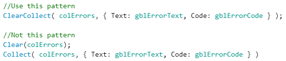
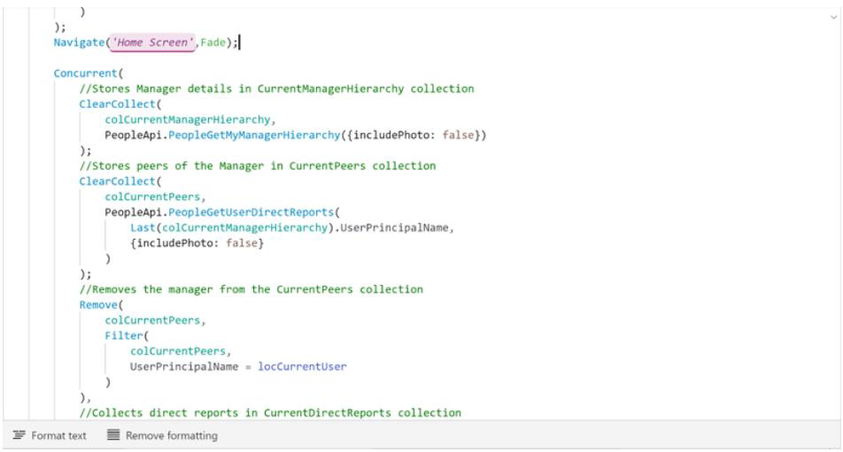

# General coding guidelines

## OnStart property

In general, try to limit the code that you put in the ```OnStart``` property, because it’s difficult to debug. To debug code there, you must save, close, and then reopen your PowerApps app in PowerApps Studio to make the code run again. You can’t create context variables in this property. Think of it as Application.OnStart, which runs only once before any screen is shown.

## OnVisible property

The ```OnVisible``` property is the place to put code that must run every time a user goes to a screen. Be careful about putting code in this property. If possible, avoid putting logic in the ```OnVisible``` property on the first screen of your PowerApps app. Instead, try to use inline expressions in control properties.

The ```OnVisible``` property is a great place to set global or context variables. However, be careful about the calls that you make to set those variables. Quick calls, such as calls to Office365Users.Profile or calls to set a static colour for reuse in controls, are acceptable. However, stay away from complex logic and code that takes a long time to run.

## Context variables

Limit your use of context variables. Try to use them only when they’re absolutely necessary.Know when to use context variables versus global variables. Use a global variable when you need it to be available on all screens. Use a context variable if you want to limit the scope of a variable to a single screen.

Avoid passing context variables between screens when a global variable might be more appropriate (and much easier to debug).

## Collections

Limit your use of collections. Try to use them only when they’re absolutely necessary.

Use ```ClearCollect()``` instead of ```Clear();Collect();```.



To count the records in a local collection, use CountIf instead of Count(Filter()).

## Concurrent

PowerApps runs your data source calls from top to bottom in a module. If you have several calls, this linear execution can negatively affect app performance. One workaround for this issue has been to use timer controls to concurrently fire data calls. However, this approach is difficult to maintain and debug, especially when some timers depend on other timers.

The Concurrent function eliminates the need to use timer controls to make multiple data calls at the same time. The following code snippet replaces several API calls that used to reside in the ```OnTimerStart``` property of timer controls in the app. This approach is much easier to maintain.


