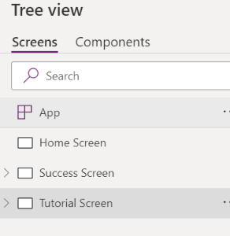
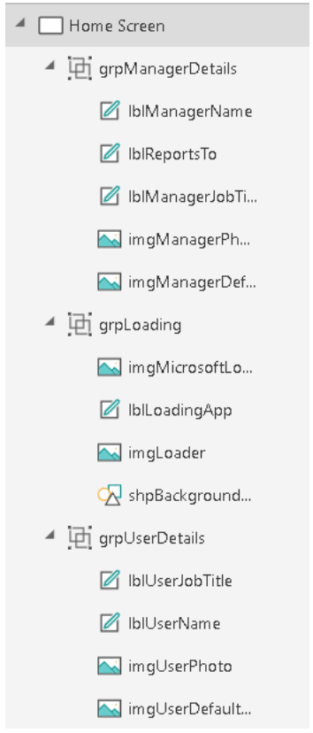

# General Naming Conventions

## Camel case

You should use camel case for controls and variables. Camel case begins with a lowercase prefix, removes all spaces from object or variable names, and capitalises the first letter of each word after the first. For example, a text input control might be named txtUserName.

## Pascal case

You should use Pascal case for data sources. Pascal case is sometimes referred to as “upper camel case.” Like camel case, it removes all spaces and capitalises the first letter of words. However, unlike camel case, Pascal case also capitalises the first word. For example, a common data source in PowerApps is the Microsoft Office 365 Users connector, which is named Office365Users in your code.

# Object naming conventions

As we create objects in your PowerApps apps, it’s important to use consistent naming conventions for screens, controls, and data sources. This approach will make your apps easier to maintain, can help improve accessibility, and will make your code easier to read as those objects are referenced.

## Screen names

Screen names should reflect the purpose of the screen, so that it’s easier to navigate through complex apps in PowerApps Studio.

What’s less obvious is that screen names are read aloud by screen readers, which are needed for users who have vision accessibility needs. Therefore, it’s imperative that you use plain language to name your screens, and that the names include spaces and no abbreviations. Also, we recommend that you end the name with the word “Screen,” so that the context is understood when the name is announced.

Here are some good examples:

- Home Screen
- Success Screen
- Tutorial Screen

Here are some bad examples:

- Home
- LoaderScreen
- EmpProfDetails
- Thrive Help

## Control names

All control names on the canvas should use camel case. They should begin with a three-character type descriptor, followed by the purpose of the control. This approach helps identify the type of control and makes it easier to build formulas and search.

Here’s a good example: lblUserName

The following table shows the abbreviations for common controls.

| Control name | Abbreviation |
| --- | --- |
| button | btn |
| camera control | cam |
| canvas | can |
| card | crd |
| collection | col |
| combo box |	cmb |
| dates | dte |
| drop down | drp |
| form | frm |
| gallery | gal |
| group |	grp |
| header page shape | hdr |
| html text | htm |
| icon | ico |
| image | img |
| label | lbl |
| page section shape | sec |
| shapes (rectangle, circle, and so on) | shp |
| table data | tbl |
| text input | txt |
| timer | tim |

Control names must be unique across an application. If a control is reused on multiple screens, the short screen name should be suffixed at the end – for example, galBottomNavMenuHS, where “HS” stands for “Home Screen.” This approach makes it easier to reference the control in formulas across screens.

Here are some bad examples:
- zipcode
- Next

## Data source names

When you add a data source to your application, the name can’t be changed in the PowerApps app. The name is inherited from the source connector or data entities that are derived from the connection.

Here are some examples:

- Name inherited from the source connector: The Office 365 Users connector is named Office365Users in your code.
- Data entities derived from the connection: A Microsoft SharePoint list that’s named Employees is returned from the SharePoint connector. Therefore, the name of the data source in your code is Employees. The same PowerApps app can also use the same SharePoint connector to access a SharePoint list that’s named Contractors. In this case, the name of the data source in the code is Contractors.

## Variable names

- Prefix context variables with loc.
- Prefix global variables with gbl.
- The name after the prefix should indicate the intent/purpose of the variable. Multiple words can be used and don’t have to be separated by any special characters (for example, spaces or underscores), provided that the first letter of each word is capitalised.
- Use Camel casing. Begin your variable names with a prefix in lowercase letters, and then capitalise the first letter of each word in the name (that is, lowerUppperUpper).

Here are some examples:

- Global variable: gblFocusedBorderColor
- Context variable: locSuccessMessage

## Collection names

- Collections should be prefixed with col.
- The name after the prefix should indicate the intent or purpose of the collection. Multiple words can be used and don’t have to be separated by spaces or underscores, provided that the first letter of each word is capitalised.
- Use Camel casing. Begin your collection names with a lowercase col prefix, and then capitalise the first letter of each word in the name (that is, colUpperUpper).

Here are some examples:

- colMenuItems
- colThriveApps
