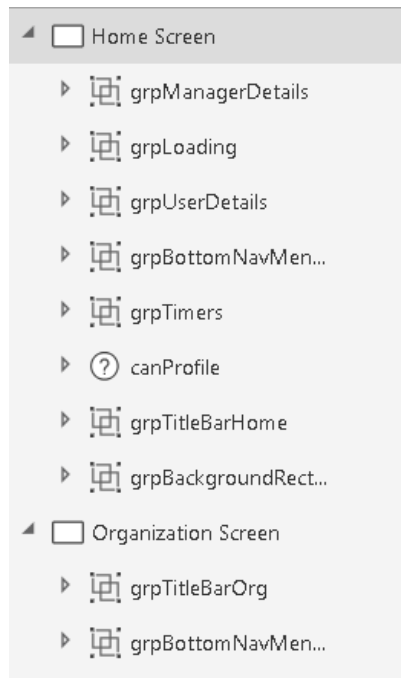
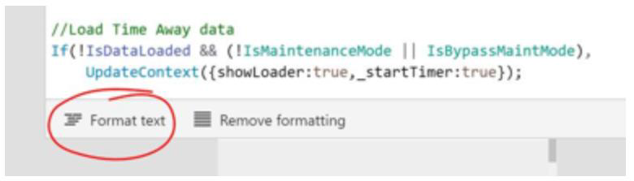
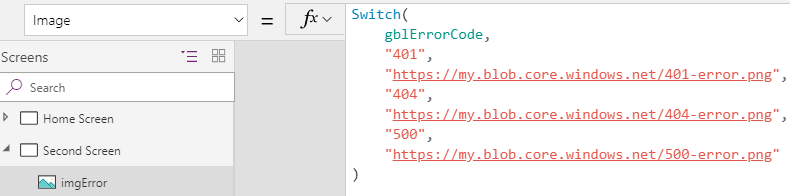

# Organising your objects and code

## Using groups

All controls on a screen should belong to a group, so that you can easily recognise their purpose, move them around a screen or between screens, or collapse them to simplify your view. Gallery, Form, and Canvas controls are already groups, but they can also, optionally, be part of another group to help improve organisation.

## Format text feature

As the complexity of a formula increases, readability and maintainability are affected. It can be very difficult to read a large block of code that contains multiline functions. The Format text feature adds line breaks and indentation to make your formula easier to read. As for code comments, the extra white space is removed from the app package that’s downloaded to the client. Therefore, there’s no need to use the Remove formatting feature before you publish your app.

## Minimizing the number of controls that you create

To minimize complexity, try to limit the number of controls in your apps. For example, instead of having four image controls that lie on top of each other and have different Visible property settings, use one image that includes logic in its Image property to show different images.

