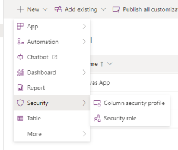

# Security roles in Power Platform

This document details the method in which we manage security within Power Platform and Office 365 and the approach to take when developing new applications.

By default, when we create a Power Platform environment, we provide users with only the "Basic User" security role provided out-of-the-box by Power Platform. This grants them some access to run an app within the environment and perform common tasks for the records that they own but this only applies to non-custom entities - for example, any Dataverse tables added as part of a solution will not be accessible. As a result, each app will need at least one security role to grant access to custom entities.

1. Security roles for applications should be packaged as part of their solution. Within the solution select the option to add a New component → Security → Security role:

2. The security role should be named based on the app name and the name or role of the user group it will be assigned to. For example Room Booking Users and Room Booking Admin.

3. Assign suitable permissions for the role ([See Microsofts guidance on creating a custom role](https://docs.microsoft.com/en-us/power-platform/admin/database-security#create-or-configure-a-custom-security-role)):
    - Any tables that you have added to the solution can be found in "Custom entities".
    - If your app uses automate, you may need to include Organisation level read on "Process" within the "Customization" tab.

4. Access should be granted using the principle of least privilege.

These roles will then be assigned to a Power Platform team, **NOT** to an individual user. 
